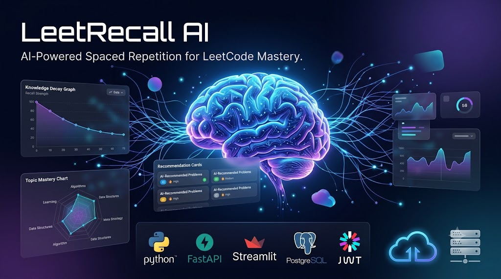
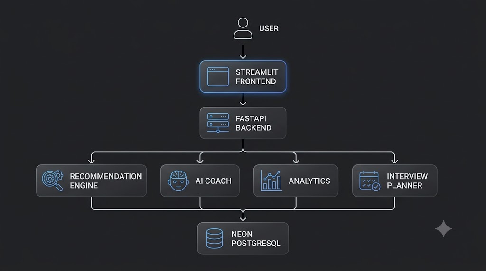
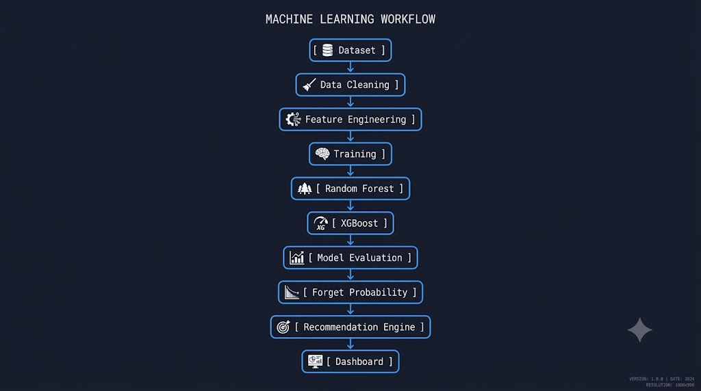
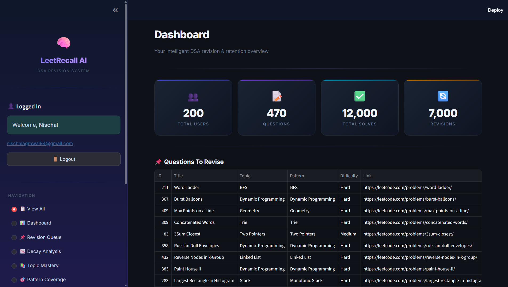
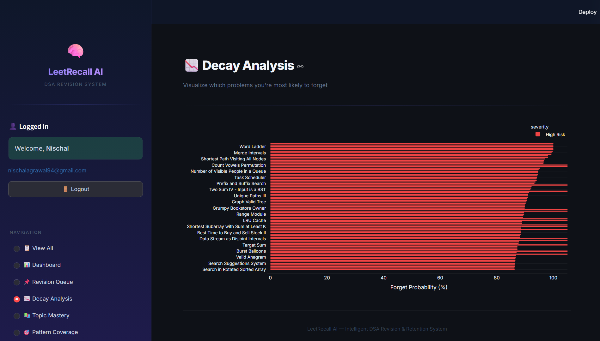
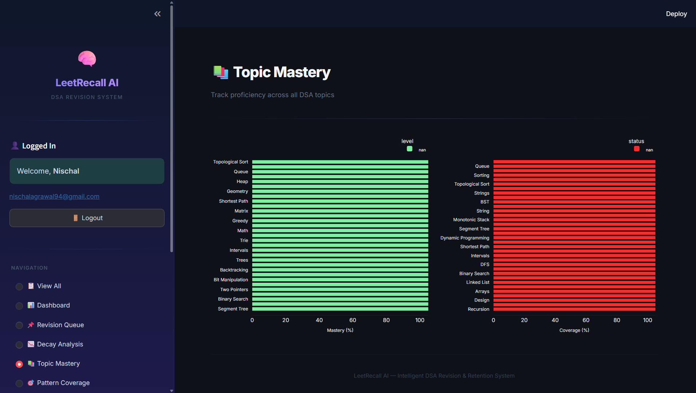
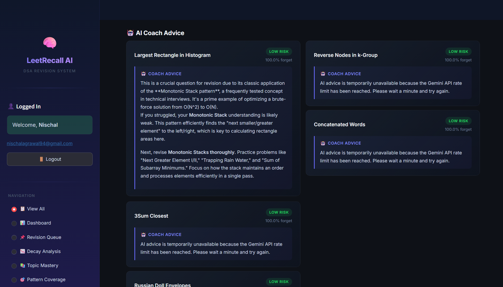
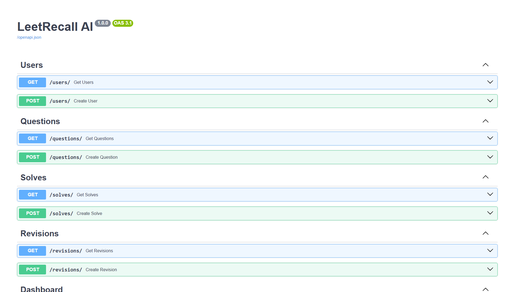
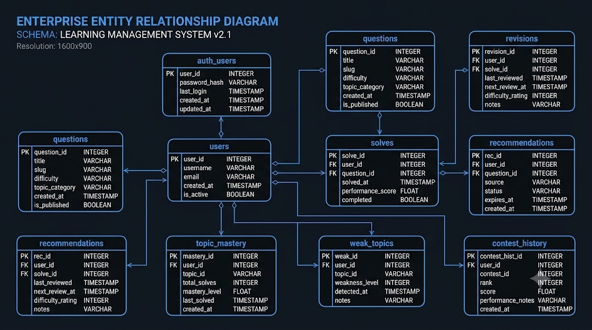
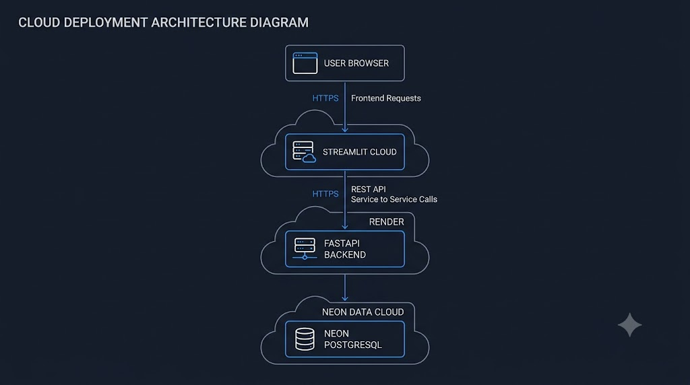

<div align="center">

# 🧠 LeetRecall AI

### Intelligent DSA Revision & Knowledge Retention Platform powered by Machine Learning

<p align="center">



</p>

<p align="center">


</p>

<p align="center">

**Predict • Analyze • Revise • Improve**

</p>

</div>

---

# 📖 Overview

LeetRecall AI is an end-to-end AI-powered learning platform designed to help competitive programmers and interview candidates retain Data Structures & Algorithms knowledge more effectively.

Instead of only recording solved problems, the platform predicts which questions are likely to be forgotten, recommends intelligent revision schedules, analyzes learning progress, and provides AI-powered study insights.

The project combines modern full-stack development with Machine Learning to create a production-style intelligent revision assistant.

---

# ❓ Problem Statement

Most programmers solve hundreds of DSA problems during interview preparation.

However, after a few weeks they usually forget

- important patterns
- tricky algorithms
- problem-solving intuition

Traditional coding platforms answer:

> **"Which questions have you solved?"**

LeetRecall AI answers:

> **"Which questions are you likely to forget next?"**

---

# 💡 Solution

LeetRecall AI uses Machine Learning models to estimate knowledge retention.

Based on predicted forgetting probability, revision history and topic analytics, it generates personalized revision recommendations instead of random practice.

The platform also provides rich dashboards for:

- Knowledge Decay
- Topic Mastery
- Weak Areas
- Pattern Coverage
- Contest Analysis
- AI Coaching
- Interview Planning

---

# 🚀 Key Features

| Feature | Description |
|----------|-------------|
| 🔐 Secure Authentication | JWT-based Signup, Login and Logout |
| 🤖 ML Recommendation Engine | Predicts revision priorities using Machine Learning |
| 📉 Knowledge Decay | Estimates forgetting probability of solved questions |
| 📚 Topic Mastery | Measures proficiency across DSA topics |
| 🎯 Pattern Coverage | Tracks exposure to algorithmic patterns |
| ⚠️ Weak Topic Detection | Finds concepts requiring revision |
| 🏆 Contest Analyzer | Analyzes coding contest performance |
| 🧠 AI Coach | Generates intelligent study recommendations |
| 📅 Interview Planner | Creates structured interview preparation plans |
| ☁️ Cloud Deployment | Streamlit + Render + Neon PostgreSQL |

---

# 🏗️ System Architecture

<p align="center">



</p>

The application follows a modular multi-layer architecture separating the frontend, backend, machine learning services, AI modules and database.

```text
                    User
                      │
                      ▼
            Streamlit Frontend
                      │
             REST API Requests
                      │
                      ▼
               FastAPI Backend
      ┌──────────────┼──────────────┐
      │              │              │
      ▼              ▼              ▼
 Recommendation   Analytics     AI Services
     Engine        Engine
                      │
                      ▼
             Neon PostgreSQL
```

This architecture ensures:

- Modular backend services
- Easy scalability
- Separation of concerns
- Independent ML modules
- Secure authentication
- Cloud deployment compatibility

---

# 🎯 Why This Project?

LeetRecall AI demonstrates practical integration of

- Machine Learning
- Backend Development
- Frontend Development
- Database Design
- Authentication
- REST APIs
- Cloud Deployment
- Interactive Analytics

into one cohesive production-style application.

Unlike many ML projects that stop after model training, this project deploys the complete workflow from data processing to user interaction.

---

# ⚡ Tech Highlights

- End-to-End Machine Learning Application
- Production-style FastAPI Backend
- Interactive Streamlit Dashboard
- JWT Authentication
- Password Hashing with bcrypt
- PostgreSQL Database
- SQLAlchemy ORM
- Cloud Deployment
- RESTful APIs
- Modular Project Structure

---

# 🤖 Machine Learning Pipeline

<p align="center">



</p>

Machine Learning is the core intelligence behind LeetRecall AI.

Instead of recommending random problems, the platform predicts which solved questions are most likely to be forgotten and intelligently prioritizes revision.

---

## Pipeline Overview

```text
Dataset
    │
    ▼
Data Cleaning
    │
    ▼
Feature Engineering
    │
    ▼
Model Training
    │
    ├──────────────┐
    ▼              ▼
Random Forest   XGBoost
    │              │
    └──────┬───────┘
           ▼
Model Evaluation
           │
           ▼
Forget Probability Prediction
           │
           ▼
Recommendation Engine
           │
           ▼
Interactive Dashboard
```

---

## Dataset

The project uses a realistic simulated dataset representing learner activity.

The dataset includes:

- User Profiles
- Solved Questions
- Revision History
- Contest Performance
- Topic Distribution
- Pattern Distribution
- Difficulty Levels
- Recommendation Records

This allows the recommendation engine and analytics modules to behave like a production platform while remaining easy to demonstrate.

---

## Data Processing

Before training, the dataset undergoes preprocessing:

- Missing value handling
- Duplicate removal
- Feature extraction
- Numerical encoding
- Data validation
- Normalization where applicable

This ensures clean, consistent input for model training.

---

## Machine Learning Models

Two supervised learning models were evaluated.

| Model | Purpose |
|--------|----------|
| Random Forest | Baseline retention prediction |
| XGBoost | Final recommendation model |

After evaluation, **XGBoost** was selected due to its stronger predictive performance.

---

## Recommendation Engine

The recommendation engine combines multiple signals instead of relying on a single metric.

It considers:

- Forget Probability
- Previous Revision History
- Topic
- Difficulty Level
- Learning Progress
- Historical Performance

The result is a prioritized revision queue tailored to maximize long-term retention.

---

## Why Machine Learning?

Traditional revision systems simply display solved questions.

LeetRecall AI goes further by answering:

> **Which problems should be revised first to minimize forgetting?**

This predictive approach makes revision more efficient and data-driven.

---

# 📊 Interactive Dashboard

<p align="center">



</p>

The dashboard serves as the central interface of the platform.

It aggregates insights from the recommendation engine, analytics services, and machine learning models into an interactive visual experience.

### Dashboard Highlights

- Personalized revision insights
- Learning statistics
- Interactive charts
- Recommendation summaries
- Performance analytics
- Secure authenticated access

---

# 📉 Knowledge Decay Analysis

<p align="center">



</p>

Knowledge retention naturally decreases over time if concepts are not revised.

The Knowledge Decay module estimates the probability that a solved problem has been forgotten.

Instead of encouraging random practice, users receive revision suggestions based on predicted retention.

### Benefits

- Smarter revision scheduling
- Reduced forgetting
- Better interview preparation
- Improved long-term retention

---

# 📚 Topic Mastery

<p align="center">



</p>

Topic Mastery provides a high-level overview of a learner's strengths and weaknesses across different DSA topics.

Examples include:

- Arrays
- Strings
- Trees
- Graphs
- Dynamic Programming
- Greedy Algorithms
- Binary Search
- Sliding Window

This allows learners to focus on topics that require additional practice.

---

# 🎯 Pattern Coverage

Pattern Coverage measures exposure to common algorithmic techniques.

Examples include:

- Two Pointers
- Sliding Window
- BFS
- DFS
- Binary Search
- Greedy
- Dynamic Programming
- Backtracking
- Union Find

Instead of focusing only on problem count, the platform emphasizes conceptual coverage across diverse problem-solving patterns.

---

# ⚠️ Weak Area Detection

Weak Area Detection automatically identifies topics and patterns that require immediate attention.

It analyzes:

- Low mastery topics
- High forget probability
- Insufficient revision history
- Pattern gaps

These insights help users prioritize their preparation effectively.

---

# 🏆 Contest Analyzer

The Contest Analyzer provides post-contest performance insights.

It summarizes:

- Problems solved
- Difficulty distribution
- Topic distribution
- Pattern coverage
- Areas for improvement

The goal is to convert contest performance into actionable learning insights.

---

# 🧠 AI Coach

<p align="center">



</p>

The AI Coach enhances the learning experience by generating personalized study guidance.

It can assist with:

- Revision recommendations
- Weak topic suggestions
- Interview preparation
- Learning strategies
- Progress interpretation

This transforms static analytics into meaningful, actionable advice.

---

# 🔌 REST API

<p align="center">



</p>

The frontend communicates with the backend exclusively through REST APIs.

| Method | Endpoint | Description |
|----------|-----------|-----------------------------|
| POST | `/auth/signup` | Register a new user |
| POST | `/auth/login` | Authenticate user |
| GET | `/dashboard` | Dashboard analytics |
| GET | `/recommendations` | Personalized recommendations |
| GET | `/knowledge-decay` | Knowledge retention analysis |
| GET | `/topic-mastery` | Topic analytics |
| GET | `/pattern-coverage` | Pattern statistics |
| GET | `/weak-topics` | Weak area analysis |
| GET | `/contest-analysis` | Contest insights |
| GET | `/interview-planner` | AI interview roadmap |

The REST architecture keeps the frontend and backend fully decoupled, making the application modular and scalable.

---

# 🗄️ Database Design

<p align="center">



</p>

The project uses **Neon PostgreSQL** with **SQLAlchemy ORM**.

Core entities include:

| Table | Purpose |
|---------|---------------------------|
| users | User information |
| auth_users | Authentication records |
| questions | Question metadata |
| solves | Solved question history |
| revisions | Revision tracking |
| recommendations | ML recommendations |
| topic_mastery | Topic analytics |
| weak_topics | Weak area analysis |
| contest_history | Contest performance |

The schema is normalized and designed to support future user-specific analytics and recommendation pipelines.

---

# ☁️ Cloud Deployment

<p align="center">



</p>

LeetRecall AI is deployed using a modern cloud architecture.

| Component | Platform |
|------------|------------|
| Frontend | Streamlit Cloud |
| Backend | Render |
| Database | Neon PostgreSQL |

This separation allows each component to scale independently while maintaining a clean production-style architecture.

---
# ⚙️ Technology Stack

LeetRecall AI integrates multiple technologies across frontend, backend, database, authentication, machine learning, and deployment.

| Layer | Technology | Purpose |
|--------|------------|---------|
| Frontend | Streamlit | Interactive Web Application |
| Backend | FastAPI | REST API Framework |
| Database | Neon PostgreSQL | Cloud Relational Database |
| ORM | SQLAlchemy | Database Abstraction |
| Machine Learning | Scikit-Learn | Model Training |
| ML Model | XGBoost | Forget Probability Prediction |
| Data Processing | Pandas | Data Cleaning & Analysis |
| Numerical Computing | NumPy | Feature Processing |
| Model Persistence | Joblib | Saving Trained Models |
| Authentication | JWT | Secure User Authentication |
| Password Security | bcrypt | Password Hashing |
| Deployment | Render | Backend Hosting |
| Deployment | Streamlit Cloud | Frontend Hosting |
| Version Control | Git & GitHub | Source Code Management |

---

# 📂 Project Structure

The project follows a modular architecture for better scalability and maintainability.

```text
LeetRecall-AI
│
├── backend
│   ├── api
│   ├── core
│   ├── database
│   ├── models
│   ├── schemas
│   ├── services
│   ├── utils
│   └── main.py
│
├── frontend
│   ├── app.py
│   ├── auth.py
│   └── assets
│
├── ml
│   ├── datasets
│   ├── models
│   ├── recommendation
│   └── training
│
├── notebooks
│
├── requirements.txt
│
└── README.md
```

---

# 🚀 Installation

## Clone Repository

```bash
git clone https://github.com/YOUR_USERNAME/LeetRecall-AI.git
```

```bash
cd LeetRecall-AI
```

---

## Create Virtual Environment

```bash
python -m venv venv
```

Activate

### Windows

```bash
venv\Scripts\activate
```

### Linux / macOS

```bash
source venv/bin/activate
```

---

## Install Dependencies

```bash
pip install -r requirements.txt
```

---

## Configure Environment Variables

Create a `.env` file inside the backend directory.

```env
DATABASE_URL=YOUR_NEON_DATABASE_URL

SECRET_KEY=YOUR_SECRET_KEY

ALGORITHM=HS256

ACCESS_TOKEN_EXPIRE_MINUTES=60
```

---

## Run Backend

```bash
uvicorn backend.main:app --reload
```

Swagger Documentation

```
http://localhost:8000/docs
```

---

## Run Frontend

```bash
streamlit run frontend/app.py
```

---

# 🔄 End-to-End Workflow

```text
                   User
                     │
                     ▼
          Signup / Login (JWT)
                     │
                     ▼
           Streamlit Dashboard
                     │
                     ▼
             FastAPI REST APIs
                     │
     ┌───────────────┼────────────────┐
     │               │                │
     ▼               ▼                ▼
 Authentication  ML Prediction   Analytics Engine
     │               │                │
     └───────────────┼────────────────┘
                     ▼
             Neon PostgreSQL
                     │
                     ▼
         Personalized Dashboard
```

---

# 🔐 Authentication

Authentication is implemented using JWT (JSON Web Tokens).

### Current Features

- Secure User Registration
- Secure Login
- Password Hashing using bcrypt
- JWT Token Generation
- Protected Dashboard
- Session Persistence
- Logout

The authentication system is designed so that future versions can provide fully personalized dashboards by filtering data using the authenticated user's identity.

---

# 💡 Engineering Decisions

Several design decisions were made to keep the project modular, scalable, and production-oriented.

### Modular Backend

The backend separates APIs, services, schemas, models, and database logic.

This improves maintainability and simplifies future feature additions.

---

### Separate Frontend and Backend

The frontend communicates exclusively through REST APIs.

Benefits include:

- Independent deployment
- Better scalability
- Easier testing
- Cleaner architecture

---

### Cloud-Native Database

Neon PostgreSQL was selected because it provides:

- Managed PostgreSQL
- Cloud-native deployment
- Reliable backups
- Easy integration with Render

---

### Machine Learning Integration

Instead of training models inside the web application, trained models are loaded and used for inference.

This reduces API latency and keeps the backend lightweight.

---

# 🚧 Challenges Faced

Building LeetRecall AI involved solving several practical engineering challenges.

### Authentication

- Implemented JWT-based authentication.
- Added secure password hashing using bcrypt.
- Protected application routes.

---

### Backend Deployment

- Configured Render deployment.
- Managed environment variables.
- Integrated Neon PostgreSQL.

---

### Database Design

Designed a normalized schema supporting:

- Users
- Questions
- Recommendations
- Revisions
- Analytics

while remaining extensible for future personalization.

---

### Machine Learning

Compared multiple supervised learning models.

Selected XGBoost after evaluating prediction performance.

---

### Frontend Integration

Connected Streamlit with FastAPI through REST APIs while maintaining modularity and session management.

---

# 🛣️ Future Roadmap

The current implementation demonstrates the complete architecture of the platform.

Future enhancements include:

- 🔄 Import solved problems directly from LeetCode
- 👤 Fully personalized user dashboards
- 📧 Email verification
- 🔐 OAuth Login (Google/GitHub)
- 📱 Mobile application
- 📅 Smart AI Study Planner
- 🔔 Revision notifications
- 📈 Learning streak analytics
- 📄 Resume Analyzer
- 🤖 Adaptive recommendation engine
- ☁️ Docker deployment
- ⚡ CI/CD pipeline

---

# 🤝 Contributing

Contributions are welcome.

If you'd like to improve the project:

1. Fork the repository.
2. Create a feature branch.
3. Commit your changes.
4. Open a Pull Request.

Suggestions, bug reports, and feature requests are always appreciated.

---

# 📄 License

This project is licensed under the **MIT License**.

Feel free to use, modify, and distribute it according to the license terms.

---

# 👨‍💻 Author

## Nischal Agrawal

**Electronics & Communication Engineering (AI & ML)**

Netaji Subhas University of Technology (NSUT)


---

# ⭐ Support

If you found this project useful,

⭐ **Consider giving it a Star on GitHub!**

It helps the project reach more developers and motivates future improvements.

---

<div align="center">

## 🧠 LeetRecall AI

### Intelligent DSA Revision & Knowledge Retention Platform

Built with ❤️ using

**Python • FastAPI • Streamlit • Machine Learning • PostgreSQL**

---

*"Learn Smarter. Revise Better. Retain Longer."*

</div>